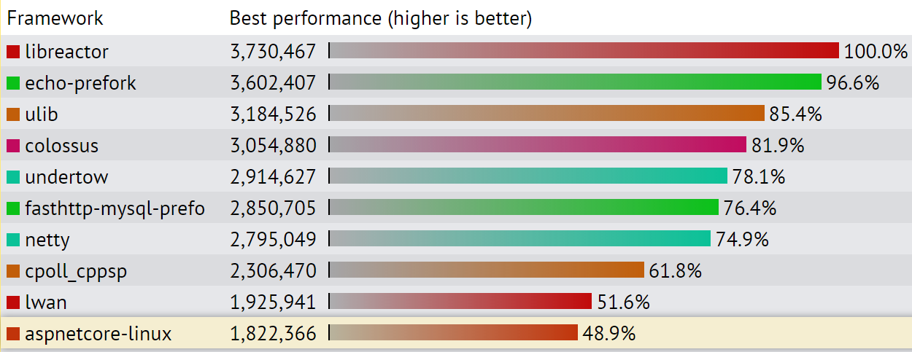
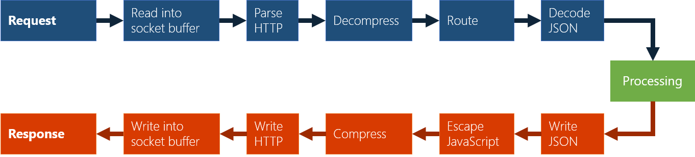
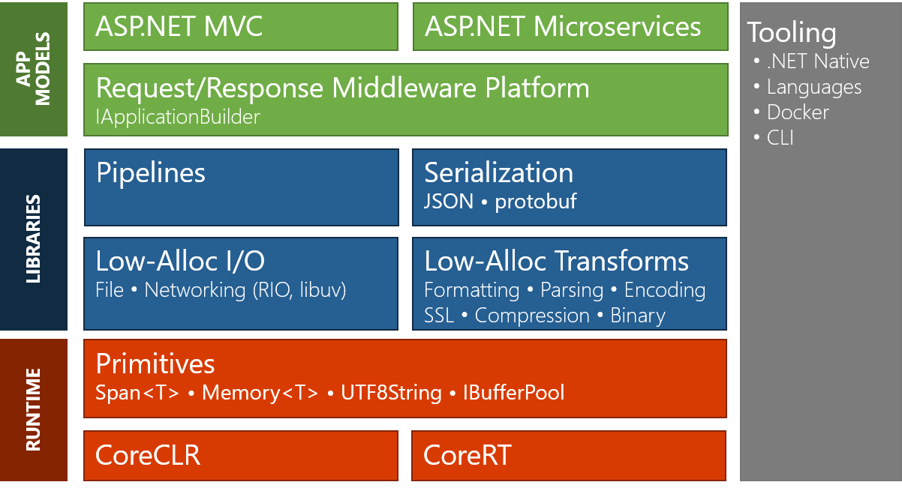

# High-Performance Data Pipelines

Our goal is to optimize .NET much more for scenarios in which inefficiencies are
directly tied to your monthly billing. With ASP.NET Core, we've already
[improved significantly][TechEmpower13] and are now in the top 10 for the plain
text benchmark. But we believe there is still a lot more potential that we could
tap into.

## Roadmap

Our primary area of focus for CoreFxLab in 2018 continues to be
to improve performance for data pipeline oriented apps. This is pretty much any
cloud app as the request-response pattern is fundamentally a data pipeline.

Consider an example for a typical web request:

Most cloud apps are parallelized by running multiple requests at the same time
while each request is often executed as a single chain. This results in the
picture above where all components are daisy-chained. That means slowing down
one component will slow down the entire request.

An important metric for a cloud app is how many requests per second (RPS) it can
handle. That's important because the load is (usually) outside the control of
the app author. So the fewer requests your app can handle, the more instances of
your app you need in order to satisfy the demand, which basically means the more
machines you need to pay for.

Also, consider the role of the framework. For the most part, your app code is
represented by the green box above, while the blue and red parts are usually
components provided by the framework. While you can optimize your app code, your
ability to reduce the overhead in the framework provided pieces is limited.

That's why many people rely on benchmarks to assess the potential of a given web
framework. It's important to keep in mind that benchmarks are by definition
gross simplifications of real-world workloads; but they are often considered to
be good at providing an indicator for the theoretical best a given framework can
do for you if you remove virtually all overhead that is specific to your app.

A widely referred to benchmark is [TechEmpower]. Here is how they
[describe][TechEmpower-Quote] why performance considerations for frameworks are
important:

> Application performance can be directly mapped to hosting dollars, and for
> companies both large and small, hosting costs can be a pain point.
>
> What if building an application on one framework meant that at the very best
> your hardware is suitable for one tenth as much load as it would be had you
> chosen a different framework?
>
> --- [TechEmpower][TechEmpower-Quote]

## What does high-performance mean?

It might not be the best term, but for the context of cloud apps the property
we're seeking to improve is scalability:

> Scalability is the capability of a system, network, or process to handle a
> growing amount of work.
>
> --- [Wikipedia](https://en.wikipedia.org/wiki/Scalability)

Many areas affect scale, but an efficient request/response pipeline is key as
it's the backbone for all cloud solutions.

Other investments (faster GC, better JIT, AOT) aren't a replacement, but will
provide additional benefits.

## Current areas of concerns

If we look at the .NET Stack, in particular the BCL, there are a few areas where
we could do much better:

1. `String` is UTF16 but networking is UTF8, forcing translations
2. Buffers are often defensively copied, slowing down operations and increasing
   allocations
3. Buffers are often not pooled, causing fragmentation and GC pressure
4. Interop with native code often creates additional buffers to avoid passing
   around raw pointers
5. Async streaming forces pre-allocation of buffers, causing excessive memory
   usage
6. ...

Our goal is to reduce the number of allocations for the basic operations, such
as parsing and encoding, having a more efficient buffer management that can
handle managed and native memory uniformly, and providing a programming model
that makes the result easy to use while not losing efficiency.

Other components of the .NET stack (such as MVC, Razor Pages and Serialization) will rewire
their implementation in order to take advantage of the efficiency gains provided
by these new APIs.

## CoreFxLab Roadmap Updates (last updated December 12, 2018)

- As part of .NET Core 2.1, [Span\<T>, Memory\<T>, and Pipelines][CodeMagazine-21] have shipped.  As such all future development on these primitive types will continue in the [corefx repo][corefx-repo] and will no longer be a part of the experimental CoreFxLab repository.

- With the release of [.NET Core 3.0 Preview 1][dotnet-blog-20181204], [System.Device.Gpio][gpio-speclet] feature development has moved from corefxlab to the new open source repo https://github.com/dotnet/iot.  This new repo contains device drivers for Linux and Windows 10 IoT Core RS5; as well as new device bindings for important sensors, motors, and displays.
- [Buffer Reader][buffers-speclet] has also graduated from the corefxlab prototype-phase and now ships in .NET Core 3.0 as System.Buffers.SequenceReader from the https://github.com/dotnet/corefx repo.  Prototype development of BufferWriter currently continues in corefxlab.

- The high-performance [System.Text.Json.Utf8JsonReader][json-announcement] has moved to the https://github.com/corefx repo as part of .NET Core 3.0 Preview 1.  Please see the [JSON Announcement][json-announcement], the [JSON Roadmap][json-roadmap], and the [Future of JSON Discussion][json-discussion] for more details on the rest of the System.Text.Json features planned for .NET Core.

## Next Wave of Experimental CoreFxLab APIs

The following areas of prototype experimentation are our primary focus in the near term.

- [Utf8String][utf8string-speclet], The cloud and the web are heavily based on UTF-8.  .NET String processing and character types are ill suited for the modern world as they require transcoding back and forth from UTF-8 to UTF-16 and use upwards of 2x as much memory.
- [BufferWriter][buffers-speclet], analogous to TextWriter but optimized for UTF-8 and byte buffer scenarios instead of UTF-16 text.

[json-discussion]: https://github.com/dotnet/corefx/issues/33115
[json-announcement]: https://github.com/dotnet/announcements/issues/90
[json-roadmap]: https://github.com/dotnet/corefx/blob/master/src/System.Text.Json/roadmap/README.md
[dotnet-blog-20181204]: https://blogs.msdn.microsoft.com/dotnet/2018/12/04/announcing-net-core-3-preview-1-and-open-sourcing-windows-desktop-frameworks/
[corefx-repo]: https://github.com/dotnet/corefx
[CodeMagazine-21]: https://www.codemag.com/Article/1807051/Introducing-.NET-Core-2.1-Flagship-Types-Span-T-and-Memory-T
[TechEmpower]: https://www.techempower.com/benchmarks
[TechEmpower-Quote]: https://www.techempower.com/benchmarks/#section=motivation
[TechEmpower13]: https://www.techempower.com/blog/2016/11/16/framework-benchmarks-round-13/
[gpio-speclet]: ./specs/gpio.md
[buffers-speclet]: ./specs/buffers.md
[utf8string-speclet]: ./specs/utf8string.md
