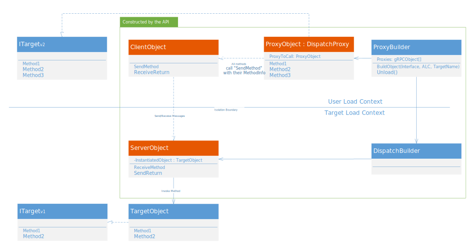
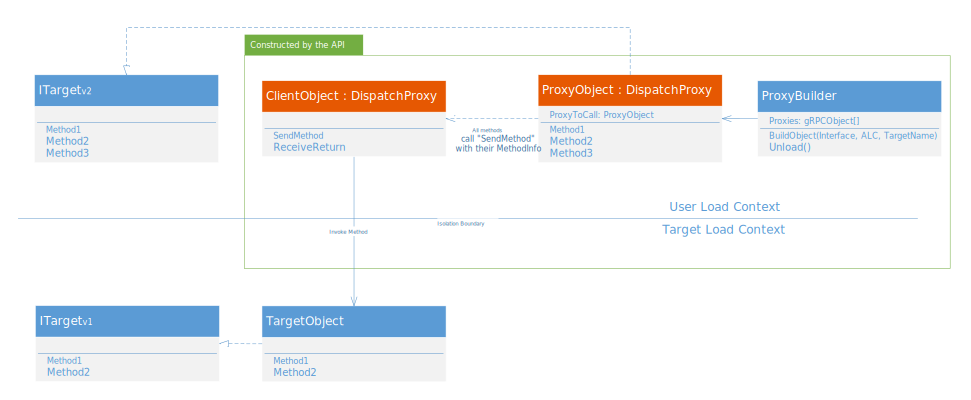
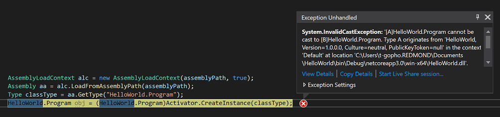

# Proxy Creation for AssemblyLoadContext to Replace AppDomain
## Problem
`AssemblyLoadContext`s currently work as an `Assembly` resolution context to work as a semi-replacement for `AppDomain`. They allow multiple versions of an `Assembly` to coexist in the same process. However, the implementation of `AssemblyLoadContext` creates only a `Type` boundary between an Application and context, compared to the `Object` boundary that `AppDomain` created. This can create complications for developers intending on using `AssemblyLoadContext` in similar ways to `AppDomain`.
In the past, a common use of AppDomain was to create objects in another `AppDomain` and use them as if they were a type in the original domain. 

## Comparison

### AppDomain
For AppDomains, developers could load objects and execute methods like so (Shortened version from [here](https://docs.microsoft.com/dotnet/api/system.appdomain?view=netframework-4.8 )):


```C#
public class SampleType : MarshalByRefObject
{
    // Call this method via a proxy.
    public void SomeMethod()
    {
        Console.WriteLine("Hello!");
    }
}
```

...and then within the main application...


```C#
...

AppDomainSetup ads = new AppDomainSetup();
ads.ApplicationBase = AppDomain.CurrentDomain.BaseDirectory;

...

AppDomain ad2 = AppDomain.CreateDomain("AD #2", null, ads);

SampleType mbrt = 
            (SampleType) ad2.CreateInstanceAndUnwrap(
                exeAssembly, 
                typeof(SampleType).FullName
            );
			
mbrt.SomeMethod();

...
```

This allows for programs and classes to be loaded with an extra boundary of isolation, to help prevent things like unstable code bringing down a process. This was removed due to the support for the implementation (`TransparentProxy`) being fairly expensive.

### AssemblyLoadContext
Currently, there is no easy way to load an object from an ALC and call methods normally on it. However, you can use reflection like so:
```C#
AssemblyLoadContext alc = new AssemblyLoadContext(assemblyPath, IsCollectible: true); //Create the ALC
Assembly aa = alc.LoadFromAssemblyPath(assemblyPath); //Load the assembly into the ALC
Type classType = aa.GetType("AssemblyName.DesiredType");

// For instantiating below, you can also use Activator.GetInstance(classType) if you know there is a default constructor that takes no arguments
object obj = (classType.GetConstructor(Type.EmptyTypes).Invoke(new object[] { }));

obj.GetType().GetMethod("SomeMethod").Invoke(obj, null);
```
The problem here is that due to Type Isolation of ALCs, you cannot directly cast the instantiated object to its original type or an inherited type, as the CLR believes them to be different types from what's loaded from the ALC. 

There are a few ways to use the instance from the ALC:
* Use reflection to invoke calls of the object's type, gotten directly using object.GetType()
* Use a shared assembly between the user and target assembly that holds a class/interface that the type you want inherits from, and using said shared type instead of the type you want directly (See [this example](https://github.com/dotnet/samples/tree/master/core/extensions/AppWithPlugin ) to see it working).
* Use `DispatchProxy` to create a proxy within the user ALC, pointing to an object in the target ALC. This also requires a shared assembly.
* Use Type Equivalence using COM and `TypeIdentifier`, which could help translate between the two "different" types in the ALCs. This does prevent the API from working cross-platform though.

Anything requiring a shared assembly could work for what we're trying to do, but comes with limitations. In .NET Framework, different versions of assemblies could be loaded into separate AppDomains, and communication could occur between objects as if they were one shared type. For example, if a user has a program that uses dependency A, and wants to load a plugin that has classes that inherit from older versions of dependency A, AppDomains would still be able to send and receive information between the plugin and the main program. 

With the creation of default interface methods, it's possible that everything will work if we have shared types between ALCs. Since we can implement similar versioning from shared interfaces, we have the power to share types across the ALC boundary, meaning if we can share assemblies, we should. This doesn't work well for cross-process communication (due to sharing dependencies not really working in that scenario), but in-process it can be a good solution.

## Proposed Solution

### Goals
This proposal is for an API that can effectively recreate the object creation capabilities in AppDomain. The goals of this design are:
* To allow for people are able to create isolated objects without the direct use of reflection. 
* To preserve AppDomains ease of use when creating isolated objects.
* To continue support for ALC unloads by removing references to the proxied objects when an `Unload` is called, allowing for the GC to clean up the ALC correctly.
* To allow for plugin compatibility to work even with minor versioning changes being made to the application.
* Attempt to design around allowing inter-process communication between the user's process and the process where the object instance will be made.

One thing that's especially interesting is use of this design to not only allow for communication between ALCs, but expanding the design to work for inter-process communication.

### Design
```C#
interface ISampleInterface {
	public void SampleMethod();
	...
}
class SampleType : SampleInterface {
	...
	public void SampleMethod(){
		...
	}
	...
}

...


public static void Main(){
	AssemblyLoadContext alc = new AssemblyLoadContext(assemblyPath, isCollectible: true);
	ProxyBuilder p = new ProxyBuilder(typeof(SampleInterface), alc, assemblyPath);
	SampleInterface testObject = (SampleInterface)p.CreateObject("SampleType");
	testObject.SampleMethod();
	...

}
```
The API surface allows for developers to create the ProxyBuilder object, and then create an instance of the proxy type, which works exactly like a normal instance of the target type, with the limitation that the target type must inherit from an interface that can be used to build the proxy object. This does limit the use of the object slightly, as use of the target object is limited to methods that exist in the interface.

---

### General Design



The ProxyBuilder API will generate five separate objects:
* `ProxyBuilder`: Responsible for creating `ProxyObject`, `ClientObject`, and `DispatchBuilder` and returns the instance of the desired proxy to the user for use.
* `DispatchBuilder`: Constructs `ServerObject` in the target ALC.
* `ProxyObject`: The object that the user has access to, it allows for method calls to run on the `TargetObject` in the target ALC. When a method is called, `ProxyObject` pipes its command to the `ServerObject`, which will eventually from the user context to the new proxy now in the target ALC using binary serialization.
* `ClientObject`: Sends messages to the `ServerObject` in the target ALC requesting `TargetObject`'s method to be called.
* `ServerObject`: Invokes `TargetObject`'s methods, and pipes the output back to `ClientObject` and the user ALC.

When a method is called, `ProxyObject` pipes its command to the `ClientObject`, which will serialize or encode the method information and any parameters passed to the `ProxyObject`, and send them to `ServerObject` through some sort of request. `ServerObject` then deserializes the data, and uses reflection to invoke the method in `TargetObject`. Once the method runs and `ServerObject` gets the returned object, it sends it back to `ClientObject`, which sends it back to `ProxyObject` to be "returned" to the user.

A `DispatchProxy` can be used to create a "fake" object of a given type, which acts as if it was the instance we wanted to use. Having `ProxyObject` inherit from `DispatchProxy` allows us to easily add more extra actions when we call the object, such as deserialization of objects across the type barrier (See the "Type-Isolation Barrier" section below).

This design is dependent on the ability for the `ProxyBuilder` to create dynamic assemblies and types within a different ALC/Process. Currently we may be able to do so by loading the `DispatchBuilder` type into the ALC directly, and then creating the proxy object from there, while also using a similar builder to create the user-side proxy that make gRPC calls. We can also wait (See [#38426](https://github.com/dotnet/corefx/issues/38426 )), but this option will not be available until said issue can be fixed, or a comparable fix is made.

### Variant for ALC Revisions with `DispatchProxy`



One thing that's nice about `DispatchProxy` is that it allows for us to load a target Type directly from the target ALC to the user ALC, allowing us to remove the `ServerObject`, and instead just call the object's methods directly. This only works for in-process communications, though, and by removing `ServerObject`, we may lose the ability to allow for and `AssemblyLoadContext.Unload()` method to de-attach the proxy and all objects associated with it (due to how the `TargetObject` may return objects). This would lead to a 


### The Type-Isolation barrier, and Client/Server send options
One of the problems with getting proxies like this working is getting past the type-isolation barrier from ALCs. For example, if you want to use type `Foo`, loading `Foo` directly vs using an ALC generates what the runtime says are completely different types, even if the implementation is the same. 



This happens for any non-simple types that attempt to cross the barrier, which is why API needs to use reflection to get the type of the ProxyObject instead of being able to grab the equivalent type in the user context.

The type-isolation barrier becomes a larger issue for parameters and return types in particular, as when we pass a `Foo` type into the proxy, we need to transform it into the `ALC.Foo` type during the transition. There are a few ways we could do this:
* Build proxies for each non-simple type that can communicate across the ALC boundaries
* Make everything a shared type (This is not recommended)
* Encode any passed objects and decode them on the other side, creating an effective "copy" of the type in the form `ALC.Foo`

The first two have their own issues, as we would either need to figure out how to build those proxies on the fly from the IL-Generated `ProxyObject`/`ServerObject`, or lose out on the benefit of versioning compatibility. The third option is what `ServerObject` and `ClientObject` intend on setting a framework for; allowing for a (possibly interchangeable) connection framework to be used to send messages to and from the ALCs (or processes).

There are a few ways we could implement the client/server encoding and messaging. The few that I've been looking at are:
* Using `BinaryFormatter` to serialize data across the boundary
* Similar serialization with `DataContractSerializer`
* Using gRPC to send objects across

#### Binary Serialization
Using `BinaryFormatter`, types and their information can be serialized and sent across the ALC barrier, and deserialized using a class for decoding, which can then call the specific `TargetObject` methods.

While Binary Serialization in concept is a good idea, there are too many issues that make this an ineffective solution. `BinaryFormatter` is a depricated API, many types aren't serializable, limiting the use of types we could proxy. 

As a side note: The current prototype that this design document is attached to won't allow for binary serialization to work easily, since the serialization process of `BinaryFormatter` doesn't seem to treat the deserialized objects as ALC types once passed to the ALC, leaving a similar type casting error we're trying to avoid with other serializers.

#### XML/JSON Serialization using `DataContractSerializer`
Instead of moving a specific type through a `BinaryFormatter`, using `DataContractSerializer` would allow us to move any public or private pieces of an object, and then recreate it on the other side.

Benefits of `DataContractSerializer`:
* It may be easier compared to `BinaryFormatter` to cast this effectively across the type-isolation barrier.
* There's no need to add attributes if you want the default behavior for `DataContractSerializer` (Serializes all public members).
* There are none of the security issues known to exist in `BinaryFormatter`.

#### gRPC
Using the [gRPC](https://grpc.io/ ) framework, we'll have a much easier time simulating inter-process communication, as it's a major part of the framework.

Benefits of gRPC:
* Easy inter-process communication.
* Simple easy to implement framework, with [some support for .NET](https://github.com/grpc/grpc-dotnet ).

Concerns with gRPC:
* Encoding objects in a way that we can manually decode and pass them into the `TargetObject` needs to be investigated further, to make sure it works.
* Limited to using http/2 for transport, which doesn't work for in-process communication (at least for current .NET implementations)

The current plan is to build with a second `DispatchProxy` for in-proc ALCs, using the `DataContractSerializer` to deal with type issues between the ALCs, and gRPC for cross-proc connections. This is since other serialization methods (like binary serialization) has a lot of potential issues that may affect the API later down the road. gRPC will probably work fine for inter-process communication, but for in-proc, we need to find an alternative to communicate between ALCs.

### Extensibility
One nice thing about the design is its ability to have its components "slotted" in and out. The main part of the project that has multiple options/paths that could be taken are all in the implementation of `ServerObject` and `ClientObject`. As long as the client can receive an instruction with info from the `ProxyObject`, and the server can invoke the `TargetObject`, the middle communication between the two can be implemented in multiple ways. If implemented right, this allows for the project to be open for anyone to add their own implementation of the communication between ALCs to suit their needs, possibly using some of the alternative ideas listed in this document.

### Notes on handling specifics

#### Versioning
There are a few guidelines we're depending on to make sure versioning works for our interfaces:
* The name of the interface needs to remain the same.
* Method signatures that have already been created can't be edited or deleted, though new ones can be added.

There may be cases where the main program attempts to make a method call to an older plugin, where the method doesn't exist. When the API makes a call to `TargetObject` through `ServerObject`, it will be using `Reflection.Invoke`, meaning if there ever is a case where we don't have the requested method we're calling, the invoke should throw a `TargetException`, which we could *potentially* do something with, but probably not.

#### ALC Unloading and Proxy Behavior

##### Out-of-process
When a process gets destroyed, unloaded, or removed in some way, the fored unload needs to be dealt with on the `ClientObject` side.

The IPC formed between the `ClientObject` and `ServerObject` should be able to recognize when the server's process is killed, by either having the `ServerObject` send a signal to `ClientObject` that it's being destroyed, or by having `ClientObject` recognize when the IPC channel has been destroyed. When this happens, we can throw errors whenever the program attempts to use the `ProxyObject`, stating that the proxy is no longer valid.

##### In-process
When we unload an ALC that has a proxy connection, there is no immediate destruction of the context, unlike the out-of-process scenario. Instead, the GC will collect the unloaded `AssemblyLoadContext` normally, once it has been dereferenced by all other objects. The main question for this API is how do we want to support a scenario when `AssemblyLoadContext.Unload()` is called. Do want to lock the ALC out from unloading as long as a proxy exists to the ALC, or break that connection and give the ALC the ability to be collected (assuming there aren't any other references)?

There are a few options we could take to answer this question:

* Give the link between the proxy and the object a weak reference, so that when the ALC attempts to unload, it won't have to wait on the proxy to be dereferenced for the ALC to unload. This could also be done by severing the link between the proxy and the ALC during the `AssemblyLoadContext.Unloading` event. If we built connections to ALCs using only proxies, users could build systems that allow for more consistent unloading from an ALC.
* Give a strong reference between the proxy and target. When `AssemblyLoadContext.Unload()` is called, so that the connection isn't severed in the unloading process. This works similarly to current objects that reference other objects within an ALC.


There's some value in creating weak references using proxies, as the more consistent unload may be useful for users (it's still dependent on the GC collecting the ALC after `Unload()` is called, but we know with this situation that the ALC won't be held by the proxies). That said, both have their advantages, and we could also implement an option when creating an object for Strong vs Weak references, defaulting to one specifically.

In terms of implementation, strong references aren't too difficult to create, as they are just references from the proxy structure between the client and server that don't have any special cases for it to be broken. For the weak type, we need to either use direct weak references (such as with [ConditionalWeakTable](https://docs.microsoft.com/dotnet/api/system.runtime.compilerservices.conditionalweaktable-2?view=netcore-3.0 )) or a destroyable strong reference. If we use a severed strong reference, we can keep the `Unload()` behavior of the proxy consistent, as while the `ProxyObject` is still allowed to be called in code post-ALC unload, it should always throw an exception that the proxy no longer has a connection to the ALC object being used post-call. After severing the connection between client and server, we could also get the `ProxyObject` could remove its reference to the `ClientObject`, opening it up to be collected by the GC.

In either scenario, there's no need for the `ServerObject` to dereference the target object, since they are both within the target ALC, and can be removed whenever the target ALC cleans itself up.

There are a few potential places where this isolation isn't perfect, which is discussed in the next point.

#### Call-by-value vs more proxy creation
Let's say you want to call method `M()` on your `TargetObject`, which returns an object of type `A`, a non-primitive. When it returns the object from the target ALC (where `A` was created) back to the user ALC (where we made the original call for `M()`), we've created an extra reference between the ALCs that we need to deal with. There are a few ways we could try and fix this issue:
* Don't support non-primitive objects being passed to and from the ALCs
This isn't recommended since it limits use of the target ALC by quite a lot, but for a quick and dirty version, it could work.
* For each non-primitive object, generate another proxy that passes back to the user ALC instead of the reference to the normal object. When we unload, we can then remove this proxy as well, keeping the isolation barrier intact.
This is very similar to how AppDomains handle MarshallByRef objects, and it keeps the functionality the same, but also adds a lot more overhead from creating the proxies during runtime for every non-primitive object passed through.
* Keep everything call-by-value, by making sure any `ServerObject` returns to the user ALC is the metadata of any object, that gets reconstructed when returning to `ClientObject`
This option is nice since it works for both inter-process and in-process communication. However, having every object only able to return by value means that we'll be limited to making calls changing objects to a single ALC, and the multiple copies of an object may increase space and cause performance issues.

For my planned implementation, I'll be trying to implement call-by-value, since it keeps the design consistent for all types (primitive and non-primitive) and for in-proc vs cross-proc. This is to make sure that we don't need to worry about creating any additional proxies while passing non-primitive objects between ALCs or processes.

However, due to the design for extensibility, it's possible that anyone who wants to change the API can implement any of these options in their own way, by changing the interactions of `ClientObject` and `ServerObject`. If someone wants to limit interactions between plugins and the main context to primitives only, they're welcome to do so with this design.

#### Generic Types
For generics, the API should probably allows users to pass in a list of types "in order" that are being used for the particular instance of an object they are creating. 

`DispatchProxy` should be OK to use generic types, but it may be an issue funneling these types through whatever server structure is created. 

For constraints on certain generics, the compiler should pick up any issues with constraints from the given interface, but may not from constraints for the TargetObject, and will throw an error.

#### Performance
No matter the performance of this API, by design it won't have the broader performance issues that AppDomains had in .Net Framework, since they work very similarly to normal classes. However, there may be some overhead and performance issues on any objects being contacted by the proxies, which should be investigated if they come up.

Some hard points of performance that probably will need to be looked at:
* Methods of serialization (specifically the prototype's use of `DataContractSerializer`)
* Client/server calls on in-process ALCs
* Multiple uses of `Reflection.Invoke` possibly being called

These are some of the highlights after running the proxy system through the visual studio profiler (vs2019, 16.3 preview 1) with a sample application. The object doesn't take any arguments in its constructor, and the tested method doesn't load any additional assemblies into the target ALC, and does little basic operations. The method itself takes in one string parameter, performs an `ArrayList.Add(DateTime.Now)` operation with an existing array, and returns a new string. While testing the method took ~1% of CPU samples.:


##### Performance Metrics: ALCProxy vs AppDomains
Here are the tables of small samples being run through .NET Benchmark. The "Control" times are representing normal object calls/creation in .NET Core/Framework respectively, to get a better comparison of both proxy systems to a similar standard.

All the tests for .NET Core are found under tests/Benchmarks/ALCProxy/ALCBenchmark.cs. I made the AppDomain comparison running the same methods, though it's not in the benchmarks project since it's running on .NET Framework 4.7.2

###### ALCProxy on .NET Core 3.0
|                            Method |           Mean |         Error |        StdDev |
|---------------------------------- |---------------:|--------------:|--------------:|
|                 CreateProxyObject |  34,812.116 ns |   691.7122 ns | 1,881.8541 ns |
| CreateExternalAssemblyProxyObject |  58,329.507 ns | 1,154.3688 ns | 2,720.9830 ns |
|               CreateControlObject |       3.640 ns |     0.1853 ns |     0.1642 ns |
|      CallSimpleMethodThroughProxy |   6,887.738 ns |   137.4717 ns |   188.1728 ns |
|           CallSimpleMethodControl |       5.987 ns |     0.1937 ns |     0.3127 ns |
|                CreateGenericProxy |  65,674.175 ns | 1,264.7584 ns | 1,121.1754 ns |
|              CreateGenericControl |       9.438 ns |     0.3232 ns |     0.3969 ns |
|           CallSimpleMethodGeneric |  10,667.163 ns |   230.1083 ns |   551.3248 ns |
|    CallSimpleMethodGenericControl |   1,277.827 ns |    25.6223 ns |    58.8715 ns |
|                UserTypeParameters |  45,244.586 ns |   873.6857 ns | 1,166.3453 ns |
|         UserTypeParametersControl |      14.059 ns |     0.4585 ns |     0.6428 ns |
|               UserTypeParameters2 |  45,047.991 ns |   899.6754 ns | 1,318.7326 ns |
|        UserTypeParametersControl2 |       8.368 ns |     0.2960 ns |     0.4520 ns |
|           SerializeManyParameters | 118,357.982 ns | 2,336.1915 ns | 4,212.6353 ns |
|    SerializeManyParametersControl |     208.124 ns |     4.3287 ns |     7.4669 ns |


###### AppDomain on .NET Framework
|                         Method |             Mean |          Error |          StdDev |           Median |
|------------------------------- |-----------------:|---------------:|----------------:|-----------------:|
|              CreateProxyObject |   634,918.105 ns | 53,267.2756 ns | 155,383.1432 ns |   663,439.227 ns |
|            CreateControlObject |        11.312 ns |      0.3381 ns |       0.3618 ns |        11.232 ns |
|   CallSimpleMethodThroughProxy |     7,234.239 ns |    143.3793 ns |     147.2400 ns |     7,265.935 ns |
|        CallSimpleMethodControl |         5.409 ns |      0.2206 ns |       0.6039 ns |         5.569 ns |
|             CreateGenericProxy |   711,390.021 ns | 19,527.1192 ns |  56,340.2036 ns |   709,133.643 ns |
|           CreateGenericControl |        17.029 ns |      0.4236 ns |       0.5203 ns |        17.168 ns |
|        CallSimpleMethodGeneric |    16,964.157 ns |    362.9143 ns |     626.0093 ns |    16,924.974 ns |
| CallSimpleMethodGenericControl |     4,708.843 ns |     92.8184 ns |     133.1174 ns |     4,740.609 ns |
|             UserTypeParameters |   629,216.729 ns | 44,208.7335 ns | 126,843.1436 ns |   675,572.070 ns |
|      UserTypeParametersControl |        23.061 ns |      1.0978 ns |       1.7092 ns |        22.592 ns |
|            UserTypeParameters2 |    18,349.927 ns |    365.9962 ns |     435.6924 ns |    18,373.392 ns |
|     UserTypeParametersControl2 |        10.098 ns |      0.3185 ns |       0.4669 ns |        10.189 ns |
|        SerializeManyParameters | 1,416,806.691 ns | 27,672.9167 ns |  68,400.5938 ns | 1,415,770.142 ns |
| SerializeManyParametersControl |       569.277 ns |     11.2945 ns |      12.5538 ns |       573.416 ns |


The ALCProxy API currently does much better with creating new proxy objects. However, calling methods from proxy objects has similar performance times compared to `TransparentProxy` from AppDomains. 

Specifics of performance below were measured by looking at the numbers from the VS2019 performance profiler. These aren't the best measurements, but they give a general idea of what's specifically taking up time when running the API.

##### Object creation (with updated use of AssemblyDependencyResolver in the ALC)
* ~10-20% of CPU samples were to create the DispatchProxy object
* ~50% of samples is loading the server into the new ALC and calling the constructor using `Reflection.Invoke()`
* ~10% of CPU samples is to create the delegate to use whenever the Client needs to call the Server during a normal method call.

##### Calling methods on the proxied object
* ~2% of CPU samples were for calling the delegate from the `ClientObject` to call `ServerObject.CallObject`
* Searching for the method in the assembly takes around 2-3% of CPU samples.
* Serialization of parameters took around 50-65% of CPU samples. It increases drastically if we add additional parameters.
* Invoking of the method itself from the `ProxyObject` took around 10-20% of CPU samples.
* Server-side deseralization took around 10% of samples.


#### Special Language Features
Language features such as `in`, `ref`, and `out` should be investigated further, but we probably won't be able to implement them in this design since everything will be kept call-by-value, and they're also a bit out of scope for this project.

That said, these and other language features should be investigated for the future to be implemented.

#### Object Lifetime
When a proxy is created using the API, a new instance of the object type requested is created alongside the proxy, and linked to it. The current design for the API is that already created objects cannot be linked to a new proxy, there must be a new object created if it is going to be used across the type barrier. 

When an ALC is unloaded, technically the `ProxyObject` will still exist in the user ALC, but any attempt to use methods in the proxy should throw an error to the user, as there is nothing to actually call the methods on.

#### Excess types and their loading policies: Do we want shared assemblies?
A big question that comes up is how do we want to handle any of the extra types that get loaded with the proxied object? If we keep full isolation between the user's starting ALC and the target ALC to load the proxy, then for user-defined types we'd have to load the assembly a second time, which is a very costly process.

The biggest case is the loading of the `Client` and `Server` themselves, since this always happens when a proxy is generated. We could enforce that the plugin assembly has a reference to its host program. This would allow for the proxy API to be used as a shared assembly, which would prevent the costly second load. Do we want to enforce that reference requirement?

## Validation
This project is a bit harder to test past integration tests, as the most important thing to test is to ensure that the communication between `ClientObject` and `ServerObject` is correct, which can't be unit tested easily. Integration tests should attempt to run methods from proxied targets both in and out of process, passing in a mix of primitive and non-primitive objects as arguments and return types. Separate from that, we should be able to Moq "serialization and deserialization" (the decoding steps from the client and server, not neccesarily with normal serializers) by taking sample messages sent through other tests, making changes, and ensuring that messages are still decoded and encoded correctly.

Performance considerations are also fairly important, and need to be tested as well, possibly with [Perfview](https://github.com/microsoft/perfview ) or [Visual Studio](https://docs.microsoft.com/visualstudio/profiling/beginners-guide-to-performance-profiling?view=vs-2019 )

## Open Questions
* The current prototype for proof-of-concept has the `ServerObject` using `Reflection.Invoke()` to call the TargetObject methods, is there a more performant solution to running the methods of TargetObject?
* How should the API deal with generic types when creating our different proxy classes?
* Is there anything special that we need to do to deal with other language features, such as lambdas?
* Do we have a way to deal with the user ALC being destroyed before the target ALC? How do we react to that problem?
* What happens when we try to send large objects through a proxy as parameters/return types?
* Are there any better ways to perform our serialization to improve performance without losing security?

## Extra Goals
* Can we get out-of-process proxies to specify an ALC to be added to in the receiving process?


## Discovered Limitations
* As stated before, call-by-value is the only way to do anything with our current implementation, which causes problems if we want proxies to change values of passed-in objects.
* A good chunk of our performance hits come from multiple uses of `MethodInfo.Invoke`. We could improve performance by swapping most of our method calls to invoking through a `Delegate`, but for our types where we only get our type information during runtime, it may be difficult/impossible to make delegates for every method of a proxied object when we call for the `ProxyBuilder` to create them.
* For `DataContractSerialization`, larger projects need to ensure that all classes and members being used by the proxies are able to be serialized across the boundary. This requires manual placement of the `[DataContractAttribute]` and `[DataMember]` attributes across any classes needing to be proxied. For more complex classes like Tasks in MSBuild, this is close to impossible to do with our current setup.